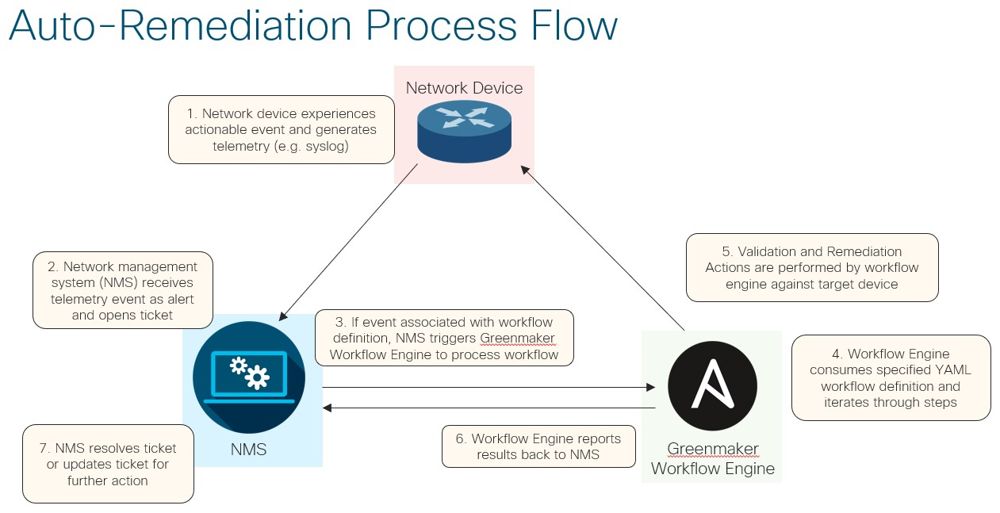

# Role Name: Greenmaker
*Version 1.3.0* - [Release Notes](https://wwwin-github.cisco.com/spa-ie/greenmaker/releases)

Greenmaker is an Ansible-based network event response platform. It provides a flexible, vendor-neutral framework for simplified creation of YAML-based action workflows to perform auto-remediation and auto-troubleshooting of network failure events.  Through the introduction of a new data model and language for describing troubleshooting actions, this framework enables network operators and vendors to define and implement highly-abstracted workflows for automated handling of failure events without coding knowledge.  The framework also integrates highly detailed metadata to support automated generation of network alerts and troubleshooting guide documentation.
<br /><br />

<br /><br />

## Greenmaker Components

For a deep dive on the Scenario Definitions and Scenario Schema, see the [Scenarios Documentation](files/scenarios/README.md).

### Scenario Definition
* The scenario definition is a YAML file that provides metadata (documentation) about a specific failure scenario, trigger conditions for the failure scenario, the auto-remediation workflow (ordered list of steps) which invokes pre-defined actions to validate and remediate the potential failure event, and a list of tests that can be performed to verify the workflow.
* The workflow within a scenario definition creates decision tree, where actions in each step are taken based upon the result of certain validation criteria.
* Supports use of pre-defined remediation actions, such as exec_cli, isolate_device, and open_case
* Leverages YAML language for human-readability and simplicity

### Scenario Schema
* The Scenario Schema is a JSON schema that defines available actions, action arguments, and all other components of the syntax of a Scenario Definition
* Can be used in VS Code editor or CI/CD pipeline to automatically detect syntax errors in scenario definition
* Can also be used to auto-generate YAML code that adheres to schema requirements

### Auto-Remediation Workflow Engine
* The Auto-Remediation Workflow Engine consumes scenario definitions in order to perform auto-remediation actions against target devices
* Implements abstractions for each action for all supported network operating systems
* Two versions being developed: Azure-specific implementation, and open-source Ansible (this role, Greenmaker)

<br /><br />

<br /><br />

## Workflow Actions ##
Workflow Actions are core to Greenmaker auto-remediation capabilities and provide a highly-abstracted, easy-to-use language for operators to define the validations and actions necessary to troubleshoot and/or remediate a network issue.  Workflow Actions are referenced within the Workflow section of a Scenario Definition, and they enable the execution of pre-defined actions that either validate the presence of a condition or take action in response to the presense of a condition.  Provided below is a high-level overview of currently supported workflow actions.  You can click on each action for additional details.

There are two types of workflow actions:  Validation Actions and Remediation Actions.

**Validation Actions** can be used within the `validation` section of a workflow `step`, and they always render a true or false result.  The purpose of a validation action is to validate state data as a condition for performing one or more remediation actions.  For example, the `eval_cli` action might be used to look for the presence of a string in the output of a "show" command on the target device.  If that string is present, certain remediation actions will be performed.

**Remediation Actions** can be used within the `on_true` or `on_false` section of a workflow `step`.  The purpose of remediation actions is to perform activities that work towards remediating the current failure event.  Examples include applying configuration changes to the device via the `config_cli` action, collection diagnostic data and opening a support case with a vendor via the `open_case` action, or exiting workflow execution with the `exit` action.  Actions in the `on_true` section of a `step` will only be executed if the validation actions for the step rendered a true result.  Actions in the `on_false` section of a step will only be executed if the validation actions for the step rendered a false result.

For more details about the anatomy of using actions within a workflow (input arguments, output parameters, etc), please see [Scenarios Documentation](files/scenarios/README.md)

### Supported Validation Actions

* [eval_cli](tasks/actions/eval_cli/README.md) - Evaluate the output of a CLI command on a target network device by looking for the presence of one or more regular expressions in the output. Can also extract one or more regexes from a command to populate variables for future use in the workflow.
* [eval_logs](tasks/actions/eval_logs/README.md) - Evaluate the output of the logging buffer of a device within a specified time range and look for the presence of a regular expressions in its output. Can also extract data from the logs to populate variables for future use in the workflow.
* [eval_var](tasks/actions/eval_var/README.md) - Evaluate the output of a CLI command on a target network device by looking for the presence of one or more regular expressions in the output. Can also extract one or more regexes from a command to populate variables for future use in the workflow.
* [and](tasks/actions/and/README.md) - Perform a logical "and" against a list of validation actions.  All actions in the list will be executed against the target device, and their boolean results will be evaluated as a logical AND.
* [or](tasks/actions/or/README.md) - Perform a logical "or" against a list of validation actions.  All actions in the list will be executed against the target device, and their boolean results will be evaluated as a logical AND.
* [call](tasks/actions/call/README.md) - Call a templatized list of actions by its name (reuse commonly used actions). Can be used for both Validation Actions and Remediation Actions.


### Supported Remediation Actions

* [exec_cli](tasks/actions/exec_cli/README.md) - Execute one or more CLI commands against target device in exec mode
* [config_cli](tasks/actions/config_cli/README.md) - Apply one or more persistent CLI configuration changes against the target device
* [open_case](tasks/actions/open_case/README.md) - Use vendor support case API to open a support case, then capture specified diagnostic commands and attach to case
* [manual_action](tasks/actions/manual_action/README.md) - Pause workflow for manual intervention until check-in is received from external source
* [custom_action](tasks/actions/custom_action/README.md) - Execute custom script logic (e.g. Ansible role) and consume data generated by the script for use as variables in Greenmaker
* [goto](tasks/actions/goto/README.md) - Jump forward to a specific step in the workflow
* [wait](tasks/actions/wait/README.md) - Wait for a specified period of time
* [exit](tasks/actions/exit/README.md) - Halt workflow and exit
* [call](tasks/actions/call/README.md) - Call a templatized list of actions by its name (reuse commonly used actions). Can be used for both Validation Actions and Remediation Actions.
* [echo](tasks/actions/call/README.md) - Outputs a string to the console.  Typically used for debugging or logging purposes, and it is analagous to the Ansible "debug" module.
* [fail](tasks/actions/fail/README.md) - Intentionally exit the workflow with a status of "failed".

### Workflow Action Support Matrix

The following support matrix presents the currently supported workflow actions for each network operating system.  Any workflow actions not listed here should be considered to be OS-agnostic (supported for all network operating systems).

|       | eval_cli | eval_logs | exec_cli | config_cli | isolate_device | open_case |
|-------|:--------:|:--------:|:--------:|:----------:|:--------------:|:---------:|
| ios   |     X    |     X    |     X    |      X     |                |     X     |
| iosxr |     X    |          |     X    |      X     |                |     X     |
| nxos  |     X    |     X    |     X    |      X     |                |     X     |
| eos   |     X    |          |     X    |      X     |                |     X     |       

## Role Variables

### Input Vars
*Note: Default values for all input vars can be found and modified in [defaults/main.yml](defaults/main.yml).*
#### Mandatory
|  Name  | Description | Default Value |
|-------|--------|:--------:|
| `scenario_name` | The name of the Scenario Definition that should be executed by the Greenmaker role. Greenmaker will look in the roles/greenmaker/files/scenarios folder for scenario_name.yml and import this scenario file as a variable that will drive execution of the scenario | undefined |
| `alert_vars` | A dictionary containing information about the event that triggered the execution of this scenario. This variable is typically populated by an alert pipeline in auto-remediation scenarios, but could also be populated manually by an operator for the purpose of manual execution of a scenario. This variable is able to be referenced within the Workflow section the Scenario Definition file and is commonly referenced for the purpose of extracting/parsing alert data for use in the Workflow. | undefined |
#### Optional
|  Name  | Description | Default Value |
|-------|--------|:--------:|
| `test_mode` | When set to "true", the workflow will be executed in Test Mode. See [Test Mode documentation](todo) for more details. | false |
| `test_type` | The type of test that should be executed. Current options available include `validation` or `remediation`.  A Validation Test simulates the presence of device output for certain action so as to test the Validation Actions in each step.  A Remediation Test follows a pre-defined set of validation results for each step and focuses on testing the execution of the on_true or on_false remediation steps against a live device. See [Test Mode documentation](todo) for more details. | \"validation\" |
| `test_name` | Specifies the name of the test from the Scenario Definition that should be executed. | undefined |
| `open_case_mode` | Describes the mode in which the open_case action should execute.  Current options available include `active` and `passive`.  In active mode, the open_case action will attempt to interact with the appropriate vendor API in order to open a support case and attach data to the support case for the target device. In passive mode, the open_case action will skip all interaction with the vendor API, instead deferring to a third party application to handle support case creation by passing all open_case related variables to the result log file. | \"passive\" |
| `gm_log_path_base` | Specifies the base directory where log files for scenario execution should be stored. | \"{{ lookup('env','HOME') }}/.ansible/tmp\" |
| `gm_log_format` | Specifies the format of the Result and Workflow log files.  Currently, the only supported format is `json`. | \"json\" |
| `gm_log_cleanup` | When set to `true` (default), this variable will cause for any log files generated during execution to be deleted prior to completion of execution. This is typically desirable in a scenario where log files are being copied to a remote datastore via the `gm_log_remote` capability. Note that when a remote copy fails or when gm_log_remote is false, log file data will be output to the Ansible task logs for diagnostic puruposes, and any diagnostic data captured by the open_case action will be deleted. | true |
| `gm_log_remote` | When set to `true`, all log data will be copied to a remote data store prior to completed execution. | false |
| `gm_log_remote_proto` |  The protocol that should be used for remote transfer of log files.  Currently, `scp` and `azure_blob_storage` are supported. | \"scp\" |
| `gm_log_remote_host` | Specifies the DNS name or ipv4 address of the remote server where log files will be transferred. | undefined |
| `gm_log_remote_user` | Specifies the username for login to the remote server where log files will be transferred. (only supported for `gm_log_remote_proto: scp`) | undefined |
| `gm_log_remote_pw` | Specifies the password for login to the remote server where log files will be transferred.  For `gm_log_remote_proto: azure_blob_storage`, the Shared Access Signature (SAS) string should be entered here. | undefined |
| `gm_log_remote_container` | Specifies the Azure Storage Blob container that should be used for remote log file uploads. Only supported with `gm_log_remote_proto: azure_blob_storage`. | undefined |
| `gm_log_remote_path` | Specifies the remote directory to which the log data should be transfered.  When not set, the root directory of the remote file share will be used. Syntax requirements: Must end with '/'. For example, 'folder1/folder2/' is valid, but 'folder1/folder2' is invalid. When using `gm_log_remote_proto: azure_blob_storage`, never use '/' at start of path (e.g. '/folder1/folder2/' is invalid) | undefined |
| `gm_log_remote_file_name` | When perfoming a remote transfer of logs, the logs are first archived in a zip file. By default, the file name is associated with the value of a fact called ORCHESTRATOR_JOB_ID: gm_<ORCHESTRATOR_JOB_ID>.zip.  If ORCHESTRATOR_JOB_ID does not exist, the file name is gm_<scenario_name>_<date_time>.zip This extra_var can be used to override the default name of the zip file. | \"{{ 'gm_' + ( ORCHESTRATOR_JOB_ID \| default(scenario_name + '_' + gm_log_timestamp) ) + '.zip' }}\" |
| `result_vars_list` | List of variables that should be included in the result log output. By adding a variable to this list, its value will automatically be includes in the `vars` section of the result log and can be used for post-processing by a third party application after execution of the scenario completes. | \[ test_mode, test_type, test_name, open_case_mode, scenario_name, alert_vars, gm_log_cli_name, gm_log_workflow_name, gm_log_result_name, gm_log_remote_file_name \] |
| `allow_multiple_hosts` | Set this extra_var to `true` in order to disable pre-check that prevents Greenmaker role from executing with more than one target host.  Useful for rare situations in which multiple hosts should be targeted for a scenario. | false |
| `reachability_test` | Set this extra_var to `true` to enable prechecking of a devices reachability, if the device is not reachable an error will be raised and scenario execution will not be attempted. | false |
| `reachability_test_timeout` | This extra_var provides the ability to set a timeout length in seconds for prechecking of a devices reachability, if not provided the preconfigued default value will be used.  | 60 |
| `reachability_test_retries` | This extra_var provides the ability to set a the number of retry attempts when prechecking a devices reachability, if not provided the preconfigued default value will be used.  | 3 |
| `scenario_timeout` | This extra_var provides the ability to set a maximum execution time (minutes) for a scenario. After this time it stops execution and renders a failed result. Default value of 0, which means no timeout.  | 0 |


### Output Vars
The following variables are generated and captured in the result log (`~/.ansible/tmp/<scenario_name>/<hostname>_result_<date_time>.log`) prior to terminating execution of a scenario. 

|  Name  | Description |
|-------|--------|
| `status` | A status identifier to indicate how the workflow execution completed.  If the workflow execution completed as the result of an action, the name of the action will be specified here.  Currently, the following values are possible:  `exit`, `manual_action`, and `open_case`.  If execution fails, a status of `failed` should be reported. |
| `exit_reason` | A plain-text description of the reason for ending execution of the workflow.  This is typically set by the action that is exiting the workflow or will include additional details about workflow execution failures |
| `exit_step` | Information about the final step that was executed prior terminating execution of the workflow. |
| `exit_step['index']` | The index number of the step that was last executed from the `workflow` list |
| `exit_step['metadata']` | A metadata dictionary that includes the `description` of the the actions performed by the step and the `name` of the step |
| `vars` | A dictionary containing all relevant variables passed to or generated by the workflow. This list can be customized via the `results_vars_list` input variable |

By default, the result log file is automatically deleted (`gm_log_cleanup: true`), because we expect this file to be uploaded to a remote file server (Azure Blob Storage instance) as specified by the `gm_log_remote_<x>` extra_vars. If you need to retrieve this log file locally (e.g. for testing), set `gm_log_cleanup: false` as an extra_var. Note that `test_greenmaker.yml` automatically sets this variable to `false` to ensure that test result logs are accessible after execution.

 Note that the `result_log` variable can also be referenced in the calling playbook to access each of these output vars as dictionary keys (e.g. `result_log['status']`).

### Sample Input Variables

```yaml

    scenario_name: "tsg_c9k_lc_failure"
    test_mode: true
    test_type: validation
    test_name: failure_unresolved
    alert_vars:
      syslog: "IOMD-2-PCIE_ACCESS_FAIL: R0/0: iomd: PCIe access failed, HW faulty on Slot 2 Subslot 0. PCIe access failed, HW faulty, shutting down this slot."

```

### Sample Output Variables

See [coming_soon.log](docs/samples/coming_soon.log)

## Execution Logs

Greenmaker generates three types of log files for each execution and stores them in the `~/.ansible/tmp/gm_< scenario_name | ORCHESTRATOR_JOB_ID >` folder by default.  If the `ORCHESTRATOR_JOB_ID` variable is defined (typically by the orchestrator, such as Ansible Tower), this value will be used.  Otherwise, the `scenario_name` will be used.

* `<hostname>_result_<date_time>.log` - This is a JSON-formatted file that contains the execution results.  See the "Output Vars" section above for details about the data logged in this file.  The expectation is that this log would be used by the NMS or alerting pipeline to consume execution results and take appropriate actions.
* `<hostname>_cli_<date_time>.log` - This is a human-readable log of the actions taken by the workflow, with a focus on the CLI data collected from the target device for each step.  This log file is automatically included in the zip file attachment generated by the open_case action to help vendors review actions taken by the workflow to troubleshoot or remediate the issue.
* `<hostname>_workflow_<date_time>.log` - This is a YAML-formatted file that contains the raw workflow along with log data from each step, validation, and action taken.  This can be used for detailed execution analysis and debugging.  *NOTE:* This feature is not fully implemented yet and currently only logs the workflow steps and not the results.

Sample Log Files for scenario `coming_soon`:

* [coming_soon_result.log](docs/samples/coming_soon_result.log)
* [coming_soon_cli.log](docs/samples/coming_soon_cli.log)
* [coming_soon_workflow.log](docs/samples/coming_soon_workflow.log)


## How Greenmaker Processes a Scenario in Ansible

<br /><br />

## Using Jinja2 in Scenarios

Jinja2 is supported for certain fields in Scenarios.

TODO: Explain where Jinja2 can be used, provide examples

## Test Instructions

A playbook called [test_greenmaker.yml](../../test_greenmaker.yml) has been created for the purpose of automating execution of tests against multiple scenarios, with the goal of simplifying integration into a CI/CD testing pipeline.

At a high level, this playbook executes the greenmaker role one or more times with a different set of "extra-vars" included each time to represent a different test scenario.  These extra-vars are managed in unique files (one per test) located in the [/tests/greenmaker/extra_vars/](/tests/greenmaker/extra_vars/) folder.

Below are a few usage examples.  For more details and usage instructions, see `/tests/greenmaker/README.md` (coming soon).

* Execute all available validation tests for the `coming_soon` scenario:<BR/>
`ansible-playbook test_greenmaker.yml -vvv -l "coming_soon" -i inventory/hosts -e '{ "target_scenarios":["coming_soon"] }'`

* Execute all available full tests for the `coming_soon` scenario against coming_soon:<BR/>
`ansible-playbook test_greenmaker.yml -vvv -l "coming_soon" -i inventory/hosts -e '{ "target_scenarios":["coming_soon"], "use_full_test": true, "use_validation_test": false }'`

* Execute a specific test found in `/tests/greenmaker/extra_vars/` as defined by the extra_vars file `\tests\greenmaker\extra_vars\iosxr\coming_soon\validation_tests\coming_soon.yml`:<BR/>
`ansible-playbook test_greenmaker.yml -vvv -l "coming_soon" -i inventory/hosts -e '{ "target_tests":["coming_soon"] }'`<BR/>
\* Note that the ".yml" file extension should NOT be included in the name of the test

* Execute all available validation tests for all available scenarios against the target device coming_soon:<BR/>
`ansible-playbook test_greenmaker.yml -vvv -l "coming_soon" -i inventory/hosts`<BR/>
\* Useful for regression testing of all scenarios for a particular operating system when making changes to Greenmaker

After completion of test execution, result logs for each scenario tested can be found in `~/.ansible/tmp/gm_<scenario_name>/`

## Production Execution Instructions

Production execution of the Greenmaker role will typically be triggered by a third party service (network management system or alerting pipeline) that makes an API call to an Ansible job orchestrator, such as AWX or Ansible Tower, to execute the Greenmaker role for a specified Scenario Definition.  For that purpose, the `greenmaker.yml` file has been supplied.  This playbook simply invokes the Greenmaker role, though it can be customized further as needed.  It is expected that the job orchestrator (or the service making an API call to the job orchestrator) will supply all necessary extra-vars for execution.

More information coming soon!
